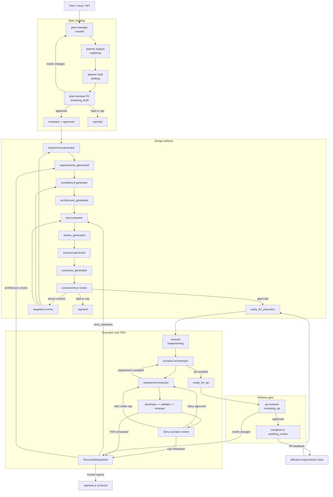
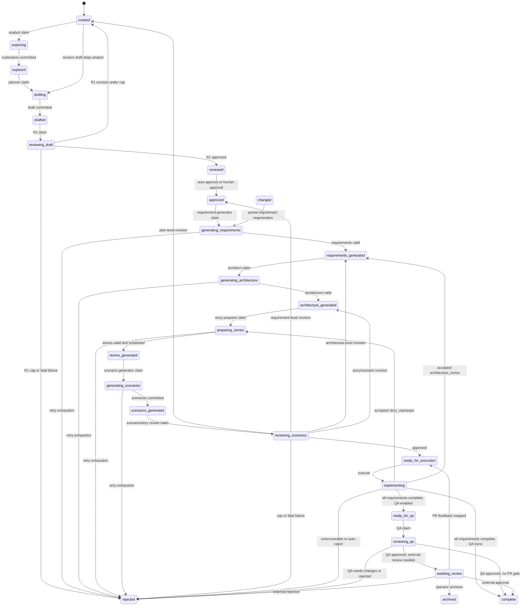
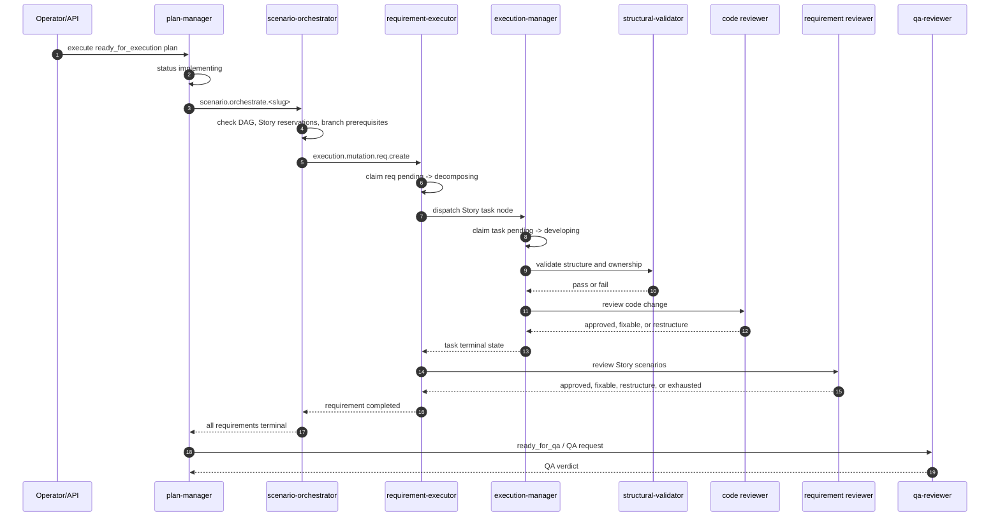
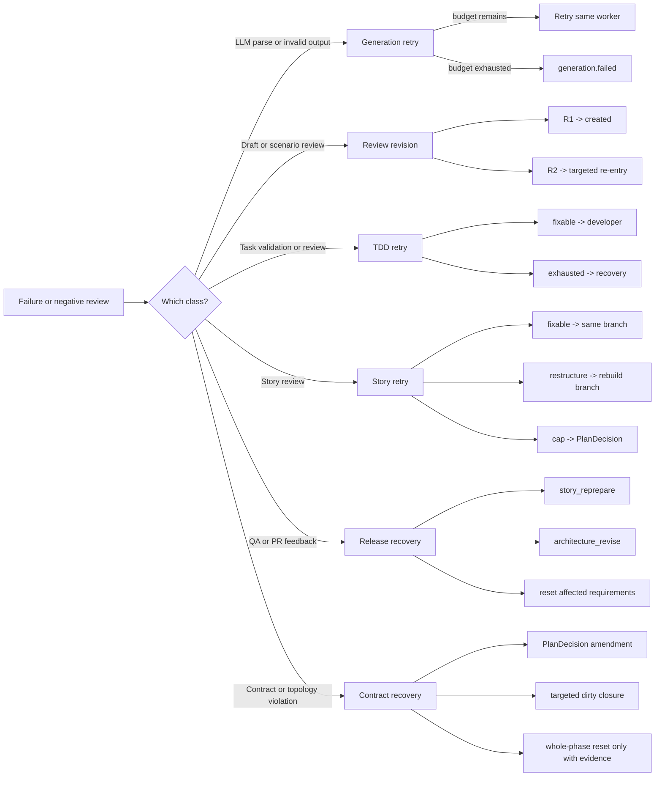

# Semspec End-to-End Flow

This is the detailed MVP flow map for Semspec. It serves two audiences:

- Semspec operators and contributors who need to see how a request moves through the system.
- SemTeams implementers who need a starter specification for a "dev from spec" workflow.

The bias here is operational detail. Each step names who acts, why it exists, what it writes,
when it runs, where it stores state, and how happy and retry paths behave.

## Operating Model

Semspec is a state-driven workflow, not a single imperative pipeline. Components watch durable
state, claim the next in-progress status, do one bounded piece of work, and hand the result back
to the owning manager.

`Single writer`: `plan-manager` owns plan aggregates in `PLAN_STATES`; `execution-manager` owns
task state in `EXECUTION_STATES`.

`Claims before work`: workers move an entity to an in-progress status before doing LLM, sandbox,
or reviewer work.

`Stories drive execution`: Requirements are planned first, but implementation is sharded into
Stories with file ownership and dependencies.

`Contract is authority`: the original brief, constraints, scope snapshot, topology obligations,
and accepted amendments live in a Plan-owned contract packet that every role receives as a
projection.

`Topology is contract`: build roots, package manifests, workspace files, module boundaries, and
standalone-project markers are topology facts, not incidental files.

`Reviews are gates`: draft, scenario/story, task, requirement, and QA reviews are explicit state
gates.

`Recovery is explicit`: exhausted retries produce `RecoveryRequested` and `PlanDecision` evidence
instead of silently looping.

`UI summarizes truth`: banners, detail panels, and live status derive from plan-manager phase
summaries; feed rows remain drill-down evidence, not the source of current state.

`Graph mirrors meaning`: key facts are mirrored into `ENTITY_STATES` as triples for rules, queries,
and cross-component reasoning.

## Contract Authority And Brownfield Topology

The happy path is BMAD/OpenSpec-shaped, but Semspec does not let prose become the only source of
truth. `plan-manager` creates a stable root contract packet with the Plan. The packet contains the
initial brief or digest, source references, constraints, scope snapshot, topology facts, acceptance
obligations, and an amendment ledger.

The root packet is immutable. Later material changes are PlanDecision amendments with proposer,
rationale, affected nodes, and contract impact. Scope shrinkage is blocked unless a matching
accepted amendment explains why the original obligation changed. Whole-phase resets require
contract-impact evidence that the entire phase is invalid; otherwise recovery dirties the smallest
requirement/story/scenario closure that consumes the changed artifact.

Topology validation stays generic. Detectors emit facts about build roots, package manifests,
workspace files, module boundaries, baseline extension points, and standalone-project markers.
Regression fixtures can come from any composite/build failure, but the contract model applies
equally to Go modules, Node workspaces, Python packages, Rust crates, .NET projects, and mixed
repositories.

Every handoff receives a role-specific projection of the same contract:

- planner and reviewer prompts see sponsor intent, constraints, open questions, and amendments
- architect prompts see topology, existing module boundaries, and forbidden replacement moves
- story and scenario prompts see scope, files, dependencies, and acceptance obligations
- developer and reviewer prompts see allowed files, must-deliver obligations, forbidden topology
  changes, and the accepted amendment context
- recovery and QA prompts see root contract, amendments, topology evidence, and why the current
  shape changed

## System Spine

## Plan State Chart

## Planning And Design Detail

### 1. Create Plan

Who: user, GitHub integration, or API client.

When: a new request arrives.

Where: plan API, optional GitHub metadata, `PLAN_STATES`, and the root contract packet.

What: creates a Plan in `created`, initializes contract identity, captures the original brief,
scope, constraints, and any immediately known topology facts.

Why: establish the durable aggregate, trace ID, and non-negotiable contract before any role can
reinterpret the request.

Happy path: `plan-manager` persists the Plan and mirrors key facts.

Retry or recovery: invalid requests fail at the API boundary; no workflow starts.

### 2. Explore Capabilities

Who: `planner` analyst pass.

When: the Plan is `created`, analyst is enabled, and the pass is not a revision draft.

Where: `PLAN_STATES`, `AGENT_LOOPS`, and graph context.

What: claims `exploring`, discovers capabilities, and emits Exploration.

Why: determine what the project can already do before drafting scope.

Happy path: `plan.mutation.explored` moves the Plan to `explored`.

Retry or recovery: LLM or parse failures retry with prior error context; exhaustion emits
`generation.failed` and the Plan becomes `rejected`.

### 3. Draft Goal, Context, And Scope

Who: `planner` draft pass.

When: the Plan is `explored`, or revision put it back to `created`.

Where: `PLAN_STATES`, `AGENT_LOOPS`, and source graph context.

What: claims `drafting` and writes Goal, Context, and Scope as a projection of the contract.

Why: produce a reviewable spec spine.

Happy path: `plan.mutation.drafted` moves the Plan to `drafted`.

Retry or recovery: generation retries match Step 2; stale loop completions are ignored; attempted
scope shrinkage without accepted amendment provenance is rejected by `plan-manager`.

### 4. Review Draft

Who: `plan-reviewer` draft gate.

When: the Plan is `drafted`.

Where: `PLAN_STATES` and reviewer loop trajectory.

What: claims `reviewing_draft`, runs deterministic preflight, compares draft scope against the
contract, and runs LLM review.

Why: keep weak, ambiguous, or contract-eroding specs out of the generator chain.

Happy path: approved findings commit, then the Plan moves to `reviewed` and usually `approved`.

Retry or recovery: needs changes under the cap returns to `created`; cap or fatal findings move
to `rejected` and may request recovery.

### 5. Generate Requirements

Who: `requirement-generator`.

When: the Plan is `approved`, or `changed` after accepted edits.

Where: `PLAN_STATES` and `AGENT_LOOPS`.

What: claims `generating_requirements`; writes Requirements with DAG, capabilities, file ownership
intent, and contract obligation references.

Why: convert the spec spine into executable units with dependencies and ownership boundaries.

Happy path: `plan-manager` validates DAG, ownership partition, capability coverage, and no
unexplained contract loss, then stores `requirements_generated`.

Retry or recovery: parse, validation, or manager feedback retries; exhaustion emits
`generation.failed` and rejects the Plan.

### 6. Generate Architecture

Who: `architecture-generator`.

When: the Plan is `requirements_generated`.

Where: `PLAN_STATES` and architecture loop trajectory.

What: claims `generating_architecture` and writes components, boundaries, files, topology
constraints, and guidance.

Why: give Stories a concrete design surface and file map that extends the brownfield baseline
instead of replacing it.

Happy path: valid architecture is committed as `architecture_generated`.

Retry or recovery: skipped architecture still advances; topology or clean-room replacement
conflicts retry or route to targeted recovery instead of being deferred to QA.

### 7. Prepare Stories

Who: `story-preparer`.

When: the Plan is `architecture_generated`, or recovery requests `preparing_stories`.

Where: `PLAN_STATES`, Sarah loop trajectory, and `workflow/derive_story_scheduling.go`.

What: claims `preparing_stories`; maps Stories to requirements, capabilities, files, dependencies,
allowed topology changes, and contract obligation references.

Why: shard work into implementable, reviewable Story slices with explicit file ownership.

Happy path: `plan-manager` validates Stories, derives `scope.create`, checks ownership/topology
continuity, and commits `stories_generated`.

Retry or recovery: invalid component names, uncovered capabilities, bad ownership, topology
conflicts, or cycles retry; exhaustion rejects or requests targeted recovery.

### 8. Generate Scenarios

Who: `scenario-generator`.

When: the Plan is `stories_generated`.

Where: `PLAN_STATES` and Bob loop trajectories.

What: claims `generating_scenarios` and writes Story-scoped scenarios with required test tiers and
contract evidence.

Why: define behavioral evidence before code execution.

Happy path: all requirements are covered by scenarios; the Plan becomes `scenarios_generated`.

Retry or recovery: per-Story generation and publish errors retry; exhaustion rejects the Plan.

### 9. Review Scenarios And Stories

Who: `plan-reviewer` scenario/story gate.

When: the Plan is `scenarios_generated`.

Where: `PLAN_STATES` and reviewer loop trajectory.

What: claims `reviewing_scenarios` and checks scenario coverage, Story shape, topology continuity,
contract coverage, and findings.

Why: prevent execution against missing, contradictory, or untestable evidence.

Happy path: approved review moves to `ready_for_execution` when auto-approved.

Retry or recovery: revision findings choose a re-entry point: plan, requirements, architecture,
stories, or scenarios. Cap exhaustion rejects the Plan.

### 10. Approve For Execution

Who: operator or auto-approval policy.

When: the Plan has passed scenario/story review.

Where: `PLAN_STATES` and plan API.

What: moves the Plan to `ready_for_execution` if human approval is required.

Why: make execution an explicit commitment point.

Happy path: the Plan waits for execution.

Retry or recovery: the operator can reject or archive instead of executing.

## Execution Detail

### 11. Execute Plan

Who: operator or API client.

When: the Plan is `ready_for_execution`.

Where: plan API and `PLAN_STATES`.

What: moves the Plan to `implementing` and publishes `scenario.orchestrate.<slug>`.

Why: start implementation only after spec and evidence are accepted.

Happy path: orchestrator receives Plan, Requirements, Scenarios, Stories, branch metadata, and the
current contract/amendment context.

Retry or recovery: retry can re-trigger `implementing`, or reset terminal plans back to
`ready_for_execution`.

### 12. Dispatch Ready Requirements

Who: `scenario-orchestrator`.

When: a Plan is `implementing`, or a requirement completes.

Where: `PLAN_STATES`, `EXECUTION_STATES`, and the orchestration trigger payload.

What: selects ready requirements by Requirement DAG, Story availability, contract readiness, and
branch prerequisites.

Why: avoid concurrent writes to the same Story or dependent branch.

Happy path: publishes `execution.mutation.req.create` for each dispatchable requirement.

Retry or recovery: blocked requirements wait; completed requirements re-fire orchestration to
unblock dependents.

### 13. Start Requirement Execution

Who: `requirement-executor`.

When: `EXECUTION_STATES req.*` is `pending`.

Where: `EXECUTION_STATES`, requirement branch, and sandbox workspace.

What: claims `decomposing`, creates a branch, synthesizes a task DAG from Stories, carries allowed
files and contract obligations into the task prompt, and reserves the current Story.

Why: turn a Story into serial implementation tasks with branch isolation.

Happy path: dispatches task nodes to `execution-manager`.

Retry or recovery: missing Stories or invalid planning evidence fails the requirement instead of
inventing work.

### 14. Develop Task Node

Who: `execution-manager` developer pass.

When: task state is `pending`.

Where: `EXECUTION_STATES`, sandbox worktree, and agent loop trajectory.

What: claims `developing`, runs the developer, and requires concrete `files_modified` evidence
inside the task/story contract.

Why: produce a bounded code change for one task node.

Happy path: valid submitted work advances to structural validation.

Retry or recovery: parse failure, empty file list, claimed files with a clean worktree, forbidden
file ownership, or unapproved topology-controlled paths return a developer rejection or recovery
request depending on severity.

### 15. Validate Structure

Who: `structural-validator`.

When: developer submitted a task change.

Where: sandbox worktree, ownership contracts, and test command config.

What: checks deterministic constraints, ownership contracts, and topology-controlled file changes
before human-like review.

Why: catch ownership, build, and structural errors cheaply.

Happy path: passing validation advances to code review.

Retry or recovery: ordinary failures retry the developer within TDD budget; ownership planning
gaps, clean-room build roots, or unapproved topology changes fast-escalate to recovery.

### 16. Review Task Code

Who: code reviewer.

When: structural validation passed.

Where: sandbox worktree and reviewer loop trajectory.

What: reviews the task diff against the task prompt, Story contract, accepted amendments, and
returns approved, fixable, or restructure.

Why: keep task changes behaviorally correct and locally coherent.

Happy path: approved work is merged from sandbox into the requirement branch.

Retry or recovery: reviewer parse failures retry the reviewer. Fixable feedback retries the
developer until TDD budget is exhausted. Restructure escalates.

### 17. Review Story Evidence

Who: `requirement-executor` Story reviewer.

When: all task nodes for the current Story are terminal.

Where: requirement branch, Story scenarios, and Murat reviewer loop trajectory.

What: reviews Story evidence against scenarios and contract obligations.

Why: validate the Story as a behavioral slice, not just isolated task diffs.

Happy path: approved Story is marked complete; the requirement moves to the next Story or
completes.

Retry or recovery: fixable reruns the Story DAG on the same branch. Restructure recreates the
requirement branch. Retry cap emits recovery.

### 18. Reconcile Requirement Completion

Who: `plan-manager` execution convergence watcher.

When: a requirement becomes terminal.

Where: `EXECUTION_STATES` and `PLAN_STATES`.

What: reconciles completion and re-fires orchestration while the Plan is `implementing`.

Why: advance dependent requirements without a central coordinator loop.

Happy path: all completed requirements move the Plan to `ready_for_qa`, or `complete` if QA is
disabled.

Retry or recovery: failed requirements leave the Plan in `implementing` unless policy
auto-rejects; recovery decisions can re-enter planning.

### 19. Run QA

Who: `qa-reviewer` and sandbox QA.

When: the Plan is `ready_for_qa`.

Where: QA worktree, `PLAN_STATES`, and optional sandbox test execution.

What: claims `reviewing_qa`, assembles evidence, runs configured QA, and writes a verdict.

Why: validate the integrated Plan, not only individual Stories.

Happy path: approved QA moves to `complete` or `awaiting_review`.

Retry or recovery: failed or skipped executable QA is fail-closed. Topology/build-shape failures
are classified as topology defects. Needs changes or rejection creates PlanDecisions and recovery
requests with contract impact.

### 20. Apply External Review Feedback

Who: GitHub or external reviewer.

When: the Plan is `awaiting_review`.

Where: PR metadata, `PLAN_STATES`, and `EXECUTION_STATES`.

What: maps accepted review feedback to affected requirements.

Why: let external review drive targeted rework without discarding the whole Plan.

Happy path: affected requirement executions reset and the Plan returns to `ready_for_execution`.

Retry or recovery: external rejection can move the Plan to `rejected`; archival is operator action.

## Operator And UI Observability

The UI should make the current run legible without asking an operator to infer state from raw loop
rows. The source of truth is `phase_summary` on plan API responses, derived by `plan-manager` from
Plan state, execution state, active loops, QA evidence, recovery decisions, lesson activity, and
freshness metadata.

The first screen should answer:

- which phase is active now, including whether planning, execution, QA, recovery, or a human wait
  is governing the Plan
- which loops are active, completed, stale, orphaned, or disconnected from the current phase
- how many requirements/tasks are pending, running, completed, or failed during execution
- whether a PlanDecision is proposed, auto-accepted, rejected, waiting, or already applied
- which requirements, Stories, files, or contract obligations a recovery action dirties
- whether lesson decomposition is in progress, and whether its output can affect this run or only
  future prompts
- what QA evidence exists, including failed/skipped executable checks and failure category
- whether token/cost numbers are measured, estimated, or missing provider-rate evidence

The activity feed is still useful evidence, but it is not allowed to be the only way to reconstruct
current truth. Feed items that no longer match the current phase should be labeled as stale,
orphaned, or historical rather than silently appearing as live execution.

## Retry And Recovery Taxonomy

### Generation Retry

Who initiates: the current generator.

State effect: the Plan stays in the same in-progress status and increments retry state.

Typical cause: bad JSON, invalid DAG, missing coverage, or transient LLM failure.

SemTeams note: keep retries phase-local and bounded.

### Draft Revision

Who initiates: `plan-reviewer` R1.

State effect: `reviewing_draft -> created`.

Typical cause: unclear goal, scope, or context.

SemTeams note: preserve reviewer findings and make the next draft respond to them.

### Scenario Or Story Revision

Who initiates: `plan-reviewer` scenario gate.

State effect: re-enters plan, requirements, architecture, stories, or scenarios.

Typical cause: missing scenario evidence, weak Story boundaries, or architecture mismatch.

SemTeams note: revision target should be evidence-derived, not chosen by a central script.

### Developer Retry

Who initiates: `execution-manager`.

State effect: the same task returns to the developer loop.

Typical cause: fixable reviewer finding, deterministic validation error, or empty submission.

SemTeams note: do not spend reviewer retries on developer errors; keep budgets separate.

### Reviewer Retry

Who initiates: `execution-manager` or `requirement-executor`.

State effect: the same reviewer loop reruns.

Typical cause: reviewer output could not be parsed or was internally invalid.

SemTeams note: parse retries are reviewer reliability, not product rework.

### Story Fixable Retry

Who initiates: `requirement-executor`.

State effect: replay current Story DAG on the existing branch.

Typical cause: Story scenarios failed but branch shape is still usable.

SemTeams note: keep prior out-of-Story evidence; only rerun the failed Story slice.

### Story Restructure

Who initiates: `requirement-executor`.

State effect: recreate the requirement branch and re-synthesize.

Typical cause: reviewer says the Story approach is structurally wrong.

SemTeams note: treat this as branch-level rebuild, not a tiny patch.

### Contract Or Topology Recovery

Who initiates: `plan-manager`, `structural-validator`, recovery-agent, or `qa-reviewer`.

State effect: proposed or accepted PlanDecision with contract impact, plus targeted dirty closure.

Typical cause: scope shrinkage without amendment provenance, clean-room project shape, unapproved
build/workspace file creation, or QA topology failure.

SemTeams note: changing the contract is allowed, but it must be named, reviewed by policy, and
traceable to affected nodes.

### `story_reprepare`

Who initiates: accepted recovery decision.

State effect: `implementing -> preparing_stories` for affected requirements/stories, or a
whole-phase story reset only when contract impact proves the phase is obsolete.

Typical cause: Story boundaries or Story-to-file ownership are wrong.

SemTeams note: reset affected execution evidence and regenerate only the Story/scenario surfaces
that consume the changed contract or ownership facts.

### `architecture_revise`

Who initiates: accepted recovery decision.

State effect: `implementing -> requirements_generated` for affected requirements, or a whole
architecture reset only with explicit whole-phase contract-change evidence.

Typical cause: architecture no longer supports implementation or QA.

SemTeams note: preserve previous architecture as feedback, then regenerate downstream artifacts
within the dirty closure rather than discarding unrelated completed work.

### QA Rejection

Who initiates: `qa-reviewer`.

State effect: `reviewing_qa -> rejected`, plus PlanDecisions and recovery.

Typical cause: integrated behavior fails, tests fail, or required tests were skipped.

SemTeams note: QA must fail closed when executable evidence is absent or skipped.

### PR Feedback

Who initiates: external reviewer.

State effect: `awaiting_review -> ready_for_execution`.

Typical cause: accepted review comments on a submitted PR.

SemTeams note: map comments to affected requirements and reset only those executions.

## Who, Why, What, When, Where Summary

`User or upstream request source`: starts the workflow and supplies intent. It owns the initial
ask, approvals, execution trigger, and external review decisions. It acts before planning, before
execution, and during external review. It writes through API requests, GitHub metadata, and
`PLAN_STATES` mutations owned by `plan-manager`.

`plan-manager`: protects the Plan aggregate and enforces legal transitions. It owns Plans,
contract packets, Requirements, Architecture, Stories, Scenarios, QA runs, PlanDecisions, and
UI-facing phase summaries. It acts on every `plan.mutation.*` event and execution convergence
event. It writes `PLAN_STATES`, `ENTITY_STATES`, and plan artifact files.

`planner`: converts intent and project context into a reviewable spec spine. It owns Exploration,
Goal, Context, and Scope. It acts on `created`, `explored`, and revision drafts. It writes through
Plan mutations and keeps trajectory in `AGENT_LOOPS`.

`plan-reviewer`: gates draft and scenario/story quality before costly work. It owns review
findings and approval or revision decisions. It acts on `drafted` and `scenarios_generated`. It
writes `PLAN_STATES` and emits recovery when revision caps are exhausted.

`requirement-generator`: converts approved scope into dependency-aware executable requirements. It
owns requirement DAG, capability coverage, and file ownership intent. It acts on `approved` and
`changed`. It writes `PLAN_STATES` through `requirements.generated`.

`architecture-generator`: defines the implementation surface for Stories. It owns component
boundaries, implementation files, and design decisions. It acts on `requirements_generated`. It
writes `PLAN_STATES` through `architecture.generated`.

`story-preparer`: turns requirements and architecture into implementation slices. It owns Stories,
Story file ownership, Story dependencies, and `scope.create`. It acts on `architecture_generated`
and accepted `story_reprepare`. It writes `PLAN_STATES` through `stories.generated`.

`scenario-generator`: defines behavioral evidence for each Story. It owns Story-scoped scenarios
and required verification tiers. It acts on `stories_generated`. It writes `PLAN_STATES` through
`scenarios.generated`.

`scenario-orchestrator`: dispatches only requirements that are safe to run now. It owns scheduling
decisions, not durable requirement state. It acts on execute and after requirement terminal events.
It publishes `execution.mutation.req.create` and reads `PLAN_STATES` plus `EXECUTION_STATES`.

`requirement-executor`: owns a requirement branch and Story-level execution flow. It owns
requirement execution, branch lifecycle, Story reservations, and Story review. It acts on
`EXECUTION_STATES req.*` pending and task completions. It writes `EXECUTION_STATES` and Story
status through `PLAN_STATES`.

`execution-manager`: runs the TDD task pipeline. It owns task execution state, sandbox worktree,
and task merge result. It acts on `EXECUTION_STATES task.*` pending. It writes `EXECUTION_STATES`,
the sandbox worktree, and the requirement branch.

`structural-validator`: catches deterministic failures before reviewer loops burn cycles. It owns
structural validation, ownership, and topology verdicts. It acts after developer submit and before
code review. It writes task execution evidence.

`Code reviewer`: gates task-level code quality. It owns task review verdict and feedback. It acts
after structural validation. It writes task evidence and merged branch changes on approval.

`Requirement reviewer`: gates Story-level scenario satisfaction. It owns Story review verdict and
requirement-level retry or restructure guidance. It acts after Story task nodes finish. It writes
requirement evidence and Story status through `PLAN_STATES`.

`qa-reviewer`: gates integrated release readiness. It owns QA verdict, QARun interpretation,
failure classification, topology/build-shape findings, and release findings. It acts on
`ready_for_qa` or executable QA completion. It writes `PLAN_STATES` and QA worktree evidence.

`Recovery and PlanDecision handlers`: convert exhausted failures into explicit next moves. They
own `RecoveryRequested` events, accepted or rejected PlanDecisions, contract impact, amendment
provenance, and targeted dirty closure. They act when retry budgets are exhausted, topology is
wrong, or QA/review needs changes. They write `PLAN_STATES` and `recovery.requested.<slug>`.

## SemTeams Starter Contract

SemTeams can treat this as the minimum behavioral contract for a "dev from spec" workflow.

### Domain Objects

`Plan`: requires slug, status, trace ID, Goal, Context, Scope, and branch metadata. It is the root
aggregate; all major phase changes must be legal state transitions.

`ContractPacket`: requires stable ID, original brief/source refs, constraints, scope snapshot,
topology facts, acceptance obligations, and amendment ledger. The root packet is immutable;
accepted amendments explain material changes.

`TopologyFact`: requires kind, path or identifier, evidence source, and whether the fact is a
constraint or observation. It describes build roots, package manifests, workspace files, module
boundaries, baseline extension points, and forbidden standalone-project markers.

`Exploration`: requires capability inventory and project evidence. It is optional on revision
drafts, but required for first-pass capability-aware planning.

`Requirement`: requires stable ID, capability links, dependencies, and file ownership intent. It
must form an acyclic DAG and cover declared capability needs.

`Architecture`: requires components, boundaries, implementation files, and decisions. It must be
sufficient for Story preparation and downstream file ownership.

`Story`: requires stable ID, requirement links, capability links, component, files owned, and
dependencies. It must cover requirements, partition file ownership, and schedule without cycles.

`Scenario`: requires stable ID, Story or requirement link, behavior, and required test tier. It
must provide reviewable evidence for each executable Story.

`RequirementExecution`: requires requirement ID, branch, stage, current Story, attempts, and
evidence. It owns branch-level execution and Story review.

`TaskExecution`: requires task ID, node ID, stage, sandbox worktree, and reviewer evidence. It owns
one TDD node and must be bounded by retry budgets.

`QARun`: requires QA level, commands, results, skipped tests, and artifacts. It must fail closed
when required executable evidence is missing or skipped.

`PlanDecision`: requires kind, rationale, affected requirements/stories/files, and status.
Recovery actions are explicit proposals, not hidden state mutation. Contract-impact fields explain
whether the decision preserves, refines, or changes the original contract.

`PlanPhaseSummary`: requires current stage, phase, state, freshness, active loop count, and any
execution, wait, recovery, lesson, or QA summary needed by UI surfaces.

### Minimum Flow Semantics

1. A request creates a Plan in `created`; only the plan owner can mutate the Plan aggregate.
   Creation also initializes an immutable root contract packet.
2. An analyst pass may enrich the Plan with project capabilities before drafting.
3. The draft pass emits Goal, Context, and Scope as a contract projection, then a reviewer must
   gate it.
4. Requirements are generated from an approved draft and validated as a DAG with coverage and
   contract continuity.
5. Architecture is generated after requirements and must expose implementation files plus topology
   constraints.
6. Stories are generated from requirements plus architecture, then scheduled by dependency and file
   ownership.
7. Scenarios are generated after Stories and reviewed before execution can begin.
8. Material scope or topology changes require PlanDecision contract impact and accepted amendment
   provenance.
9. Execution dispatch is dependency-aware and must not run conflicting Story work concurrently.
10. Implementation happens in isolated worktrees with developer, validator, reviewer, ownership,
    and topology gates.
11. Requirement completion is Story-review based; task approval alone is not enough.
12. Integrated QA gates release and must fail closed when required evidence is absent.
13. Exhausted retries become recovery decisions with explicit accepted/rejected outcomes.
14. UI current-state surfaces derive from authoritative phase summaries, not raw feed inference.

### Storage And Event Expectations

`PLAN_STATES`: durable workflow aggregate store.

`Contract packet`: Plan-owned root contract, topology facts, and amendment ledger.

`EXECUTION_STATES`: durable execution and task store.

`AGENT_LOOPS`: inspectable agent run history.

`ENTITY_STATES`: queryable semantic state graph.

`Sandbox and requirement branches`: per-slice workspace isolation.

`recovery.requested.<slug>` and PlanDecisions: explicit recovery queue and decision lifecycle.

`phase_summary`: UI-facing normalized state derived from plan-manager authority.

`GitHub PR metadata`: external review integration with targeted reset.

## Source Pointers

These are the main live code surfaces behind this document:

- `workflow/types.go` for Plan statuses and legal transitions.
- `workflow/plan_contract.go` for root contract packet creation and identity.
- `workflow/topology_path.go` for topology-controlled path detection.
- `processor/plan-manager/mutations.go` for Plan mutations, revisions, QA verdicts, and recovery.
- `processor/plan-manager/http.go` and `processor/plan-manager/phase_summary.go` for
  UI-facing phase summaries.
- `processor/plan-manager/execution_events.go` for requirement convergence and QA transitions.
- `processor/planner/component.go` for analyst and draft generation.
- `processor/plan-reviewer/plan_watcher.go` for draft and scenario/story review gates.
- `processor/requirement-generator/plan_watcher.go`.
- `processor/requirement-generator/component.go`.
- `processor/architecture-generator/component.go`.
- `processor/story-preparer/component.go`.
- `workflow/derive_story_scheduling.go`.
- `processor/scenario-generator/plan_watcher.go`.
- `processor/scenario-orchestrator/component.go`.
- `processor/requirement-executor/component.go`.
- `processor/requirement-executor/req_watcher.go`.
- `processor/requirement-executor/req_completions.go`.
- `processor/execution-manager/component.go`.
- `processor/execution-manager/task_watcher.go`.
- `processor/execution-manager/loop_completions.go`.
- `processor/qa-reviewer/component.go`.
- `workflow/payloads/recovery.go`.
- `ui/src/lib/components/plan/RecoveryDetail.svelte`.
- `ui/src/lib/components/plan/LessonActivityDetail.svelte`.
- `ui/src/lib/components/plan/ExecutionDetail.svelte`.
- `ui/src/lib/components/activity/ActivityFeed.svelte`.
