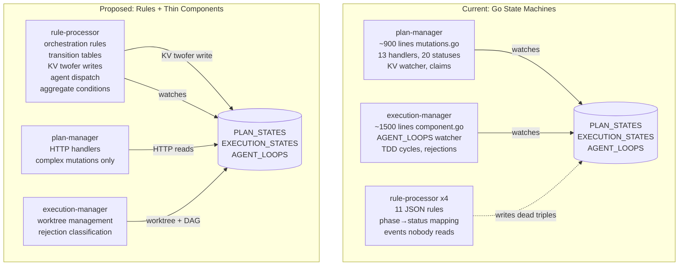

# Proposal: Rules Engine KV Twofer Integration

**Author:** Semspec Team
**Date:** 2026-04-04
**Status:** Proposed
**Target:** Semstreams rule processor + Semspec reference design

## Summary

Semspec built parallel state machines in Go that duplicate what the semstreams rules engine was
designed to handle. The rules engine DSL already has iteration budgets, agent dispatch, stateful
lifecycle tracking, and action guards — but semspec never wired them up. Two easy enhancements to
the rule processor (transition tables, KV write actions) would let the DSL handle most orchestration.
A harder third enhancement (cross-entity aggregation) would close the gap with Temporal for
fan-out/fan-in workflows.

## Problem Statement

### The parallel rules engine

An early adopter turned away from semstreams in favor of Temporal because orchestration required
writing Go state machines instead of declarative rules. Investigation confirmed the concern:

- **plan-manager** implements ~20 plan statuses, a `CanTransitionTo()` transition table, 13 NATS
  mutation handlers, and a KV watcher on EXECUTION_STATES for convergence detection
- **execution-manager** implements a KV watcher on AGENT_LOOPS for TDD pipeline routing, cycle
  budgets, rejection classification, and crash recovery
- **The rules engine** runs 4 rule-processor instances with 11 JSON rules that set a `status`
  triple and publish events — **nobody reads either output**

The rules engine is vestigial. Components coordinate via direct KV watches, and the "KV write IS
the event" twofer pattern became the actual coordination primitive.

### The DSL is massively underused

The semstreams rule processor supports far more than semspec uses:

| Feature | In semstreams DSL | Used by semspec |
|---------|-------------------|-----------------|
| Stateful transitions (on_enter / on_exit / while_true) | Yes | on_enter only |
| Iteration counting (`max_iterations` + `$state.iteration`) | Yes | No |
| Action-level guards (`When` clauses with `$state.*`) | Yes | No |
| Agent dispatch (`publish_agent` with role/model/prompt) | Yes | No |
| Workflow triggers (`trigger_workflow` with context) | Yes | No |
| Template variables (`$entity.triple.<predicate>`) | Yes | No |
| Cooldown periods | Yes | No |
| TTL on triples | Yes | No |
| 12+ operators (lt, gt, between, regex, contains) | Yes | `eq` only |
| Boid steering signals | Yes | No |
| Persistent rule state in RULE_STATE KV | Yes | Implicitly |

Semspec uses 3 features of a 12-feature DSL. Every other capability was reinvented in Go.

## Architecture: Before and After



## Gap Analysis

### Gap 1: Transition Table Enforcement

**Difficulty:** Easy
**Change location:** Semstreams rule processor expression evaluator

**Problem:** Plan-manager implements `CanTransitionTo()` — a transition table that validates "from
status X, you can only go to Y or Z." Rules have no concept of previous state validation.

**Solution:** Add a `transition` operator to the expression evaluator that checks the previous
value of a predicate before allowing the condition to match.

```json
{
  "id": "plan-created-to-drafting",
  "conditions": [
    {
      "field": "workflow.plan.status",
      "operator": "transition",
      "from": ["created", "rejected"],
      "value": "drafting"
    }
  ],
  "on_enter": [
    {
      "type": "update_triple",
      "predicate": "workflow.plan.status",
      "object": "drafting"
    },
    {
      "type": "publish_agent",
      "subject": "agentic.task.dispatch",
      "role": "planner",
      "model": "default",
      "prompt": "Generate goal, context, and scope for plan $entity.id",
      "workflow_slug": "$entity.triple.workflow.plan.slug",
      "workflow_step": "draft"
    }
  ]
}
```

**Implementation notes:**
- The evaluator already receives full entity state via `ExecutionContext`
- Previous value is available from the entity's current triples (before the triggering update)
- The `from` field accepts an array for multiple valid source states
- Invalid transitions simply don't match — no error, no action

### Gap 2: KV Write Actions (The Twofer Gap)

**Difficulty:** Easy
**Change location:** Semstreams rule processor action executor

**Problem:** Rules write to ENTITY_STATES via triple mutations but cannot write to domain KV
buckets (PLAN_STATES, EXECUTION_STATES). Components use the KV twofer pattern where the KV write
IS the event — downstream watchers (SSE, coordinators) react to KV updates automatically. Rules
only use half the twofer.

**Solution:** Add an `update_kv` action type that writes JSON to a specified KV bucket with
optional compare-and-swap (CAS) support.

```json
{
  "type": "update_kv",
  "bucket": "PLAN_STATES",
  "key": "$entity.triple.workflow.plan.slug",
  "merge": {
    "status": "drafting",
    "updated_at": "$now"
  },
  "cas": true
}
```

**Implementation notes:**
- The action executor already has access to NATS JetStream via its publisher interface
- `merge` performs a JSON merge-patch on the existing KV value (read-modify-write)
- `cas: true` uses KV revision for compare-and-swap, preventing concurrent writes
- CAS failure is not an error — the rule simply doesn't fire the action (another watcher won)
- This also partially addresses Gap 4 (claim semantics)
- New template variable `$now` resolves to RFC3339 timestamp

### Gap 3: Cross-Entity Aggregation

**Difficulty:** Hard (the moonshot)
**Change location:** Semstreams rule processor — new condition type + state tracking

**Problem:** Plan-manager's convergence logic watches EXECUTION_STATES for all requirements
matching a plan slug and transitions the plan when all reach terminal state. This is a
cross-entity query that the single-entity rule evaluator cannot express. This is also what
Temporal handles natively via workflow state.

**Solution:** Add an `aggregate` condition type that queries entities matching a pattern, scoped
by a shared field, with threshold semantics.

```json
{
  "id": "plan-convergence-all-complete",
  "conditions": [
    {
      "type": "aggregate",
      "entity_pattern": "req.*",
      "watch_bucket": "EXECUTION_STATES",
      "scope_field": "slug",
      "scope_source": "$entity.triple.workflow.plan.slug",
      "match": {
        "field": "stage",
        "operator": "in",
        "value": ["completed", "failed", "escalated"]
      },
      "threshold": "all"
    }
  ],
  "on_enter": [
    {
      "type": "update_kv",
      "bucket": "PLAN_STATES",
      "key": "$entity.triple.workflow.plan.slug",
      "merge": {"status": "reviewing_rollup"},
      "cas": true
    },
    {
      "type": "publish_agent",
      "subject": "agentic.task.dispatch",
      "role": "reviewer",
      "model": "default",
      "prompt": "Review rollup for plan $entity.triple.workflow.plan.slug. $aggregate.summary",
      "workflow_slug": "$entity.triple.workflow.plan.slug",
      "workflow_step": "rollup-review"
    }
  ]
}
```

**Aggregate template variables:**

| Variable | Description |
|----------|-------------|
| `$aggregate.total` | Total entities matching scope |
| `$aggregate.matched` | Entities matching the condition |
| `$aggregate.pending` | Total minus matched |
| `$aggregate.summary` | Human-readable "N of M completed, K failed" |
| `$aggregate.by_value` | JSON map of value counts (e.g., `{"completed": 3, "failed": 1}`) |

**Design considerations:**

**Performance.** Aggregate queries on every entity update could be expensive. Mitigations:
- Maintain incremental counters per scope in RULE_STATE KV, not full scans
- Use debounce (rule processor already supports `DebounceDelayMs`) to coalesce rapid updates
- Only re-evaluate when an entity in the scope changes (KV watch filtering by pattern)
- Index entities by scope field at watch time for O(1) lookup

**Consistency.** KV is eventually consistent across entity updates. Mitigations:
- Convergence rules should only fire on `TransitionEntered` (false → true), not `WhileTrue`
- Debounce prevents premature firing during rapid terminal-state bursts
- CAS on the KV write action prevents duplicate convergence transitions

**Thundering herd.** When multiple entities reach terminal state simultaneously (common at
execution end), each update triggers aggregate re-evaluation. Mitigations:
- Debounce coalesces updates within a window (e.g., 500ms)
- CAS ensures only one rule instance wins the convergence write
- Cooldown prevents re-evaluation after successful convergence

**Incremental counters.** The rule state tracker already persists per-entity `MatchState` in
RULE_STATE KV. Extend with per-scope aggregate state:

```go
type AggregateState struct {
    ScopeKey     string            // e.g., "plan-slug:my-plan"
    Total        int               // total entities in scope
    MatchedCount int               // entities matching condition
    ByValue      map[string]int    // count per distinct value
    LastUpdated  time.Time
}
```

Counter updates are O(1) — increment/decrement on entity state change, no full scan needed
after initial population.

**Patterns this enables:**

| Pattern | Threshold | Example |
|---------|-----------|---------|
| Convergence | `all` | All requirements terminal → plan rollup |
| Quorum | `majority` | 3 of 5 reviewers approve → proceed |
| Any | `any` | First requirement fails → alert |
| Count | `count:N` | 10 tasks completed → checkpoint |
| Percentage | `percent:80` | 80% passing → soft-complete |

### Gap 4: Claim/CAS Semantics

**Difficulty:** Medium
**Change location:** Semstreams rule processor action executor + state tracker

**Problem:** Plan-manager uses "claim" mutations — intermediate statuses (e.g., `drafting`,
`reviewing_draft`) that only one watcher can set. This prevents race conditions where multiple
rule instances react to the same status change.

**Solution:** Mostly addressed by CAS on `update_kv` actions (Gap 2). For full claim semantics,
extend the rule state tracker with a `claim` action type:

```json
{
  "type": "claim",
  "predicate": "workflow.plan.claimed_by",
  "claimant": "$rule.instance_id",
  "ttl": "5m",
  "on_conflict": "skip"
}
```

**Implementation notes:**
- Claims use triple TTL (already supported) for automatic lease expiration
- `on_conflict: "skip"` means if the triple already exists, skip remaining actions
- The rule processor's single-threaded per-entity evaluation already provides some protection
- CAS on KV writes (Gap 2) covers most practical scenarios

## What Stays in Go

Not everything should move to rules. Components should retain logic that is genuinely algorithmic
or requires capabilities beyond declarative conditions:

| Logic | Component | Why it stays |
|-------|-----------|--------------|
| DAG gating / dependency resolution | scenario-orchestrator | Topological sort is algorithmic |
| Worktree create / merge / discard | execution-manager | Git operations require Go |
| Rejection classification | execution-manager | Parsing structured LLM feedback |
| Complex data marshaling | plan-manager | Nested Plan/Requirement/Scenario structs |
| HTTP handlers + SSE | plan-manager | Request/response, not reactive |
| Crash recovery reconciliation | both managers | KV replay + graph fallback |

## Temporal Comparison

| Capability | Temporal | Semstreams today | After gaps closed |
|------------|----------|------------------|-------------------|
| State machine DSL | Workflow code (Go/Python/TS) | 12-feature JSON DSL (unused) | JSON DSL with transitions |
| Durable execution | Event sourcing + replay | KV twofer (write = event) | KV twofer via rules |
| Retry budgets | Activity retry policies | `max_iterations` + `$state.iteration` | Same (already works) |
| Agent dispatch | Activity/workflow | `publish_agent` action | Same (already works) |
| Fan-out / fan-in | Workflow state + signals | Go code only | Aggregate conditions |
| Convergence | Workflow await | Go KV watcher | Aggregate `threshold: all` |
| Quorum decisions | Workflow signals + count | Not supported | Aggregate `threshold: majority` |
| Cross-entity queries | Workflow state | Not supported | Aggregate with scope |
| Debuggability | Workflow history UI | Logs only | RULE_STATE KV + logs |
| Infrastructure | Temporal server cluster | NATS (already running) | NATS (already running) |
| Semantic awareness | None | Graph + triples | Graph + triples |

**Where semstreams wins:** No additional infrastructure (NATS is already there), semantic graph
integration, agent-native primitives (boid signals, publish_agent), and reactive event-driven
patterns vs imperative workflow definitions.

**Where Temporal wins:** Debuggability (workflow history replay), language parity (write in any
language), ecosystem maturity, and battle-tested distributed durability.

**The differentiator:** Closing Gap 3 (aggregation) makes semstreams competitive for the patterns
that currently require Temporal: convergence, quorum, fan-out/fan-in. Combined with semantic
awareness and zero additional infrastructure, this is a credible alternative for teams already
on NATS.

## Phased Implementation

### Phase 1: Foundation (semstreams)

Add two new capabilities to the rule processor:

- Transition operator in expression evaluator (Gap 1)
- `update_kv` action type with CAS support (Gap 2)

**Scope:** Small, well-contained changes. The expression evaluator and action executor are
clean extension points. Estimated: days, not weeks.

**Validation:** Unit tests for new operator and action type. Integration test showing a rule
that validates a transition and writes to a domain KV bucket.

### Phase 2: Reference Design (semspec)

Rewrite semspec's orchestration to use the enhanced rules:

- Replace 11 vestigial rules with real orchestration rules
- Move linear state transitions from plan-manager `mutations.go` to rules
- Move TDD cycle management from execution-manager to rules (using `max_iterations` +
  `publish_agent` + `When` guards)
- Simplify plan-manager to: HTTP handlers, convergence watcher, complex mutations
- Simplify execution-manager to: worktree management, rejection classification

**Validation:** Existing E2E tests pass with rules handling transitions. plan-manager
`mutations.go` shrinks from ~900 lines. execution-manager `component.go` shrinks from ~1500
lines.

### Phase 3: Aggregation (semstreams)

Add cross-entity aggregation to the rule processor:

- `aggregate` condition type with scope-based grouping
- Incremental counters in rule state tracker (RULE_STATE KV)
- Debounce and cooldown for aggregate evaluation
- `$aggregate.*` template variables for actions
- Threshold types: `all`, `any`, `majority`, `count:N`, `percent:N`

**Scope:** Larger effort. Requires new indexing in the state tracker and careful consistency
handling. Estimated: weeks.

**Validation:** Integration test showing convergence detection — N entities reach terminal
state, aggregate rule fires and transitions parent entity.

### Phase 4: Full Convergence (semspec)

Move remaining Go coordination to rules:

- Plan convergence from `execution_events.go` to aggregate rules
- Requirement completion detection to rules
- Components become truly thin: HTTP + algorithms only

**Validation:** Full E2E pipeline runs with convergence handled by rules. Components contain
no KV watchers for coordination (only for reconciliation on startup).

## Success Criteria

- plan-manager `mutations.go` shrinks from ~900 lines to HTTP handlers + complex mutations only
- execution-manager `component.go` shrinks from ~1500 lines to worktree/rejection/DAG only
- New semstreams users can define agent orchestration workflows entirely in JSON rules for
  linear state machines with retry budgets
- The reference design proves the rules engine handles real orchestration, not leaf-level
  bookkeeping
- An adopter can implement a Temporal-equivalent fan-out/fan-in workflow using aggregate rules
  without writing Go
