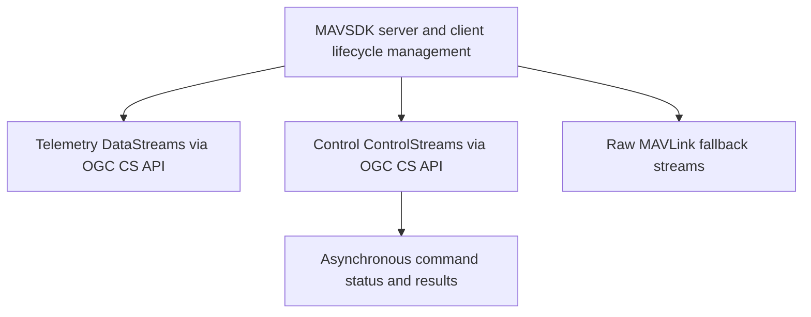

# Requirements: Starting from the existing OpenSensorHub MAVSDK addon at https://github.com/opensensorhub/osh-addons/tree/master/sensors/robotics/sensorhub-driver-mavsdk, design and implement MAVLink/MAVSDK support for OpenSensorHub through the OGC Connected Systems API.

Treat the upstream addon as the baseline, not a clean-room rewrite. Preserve its OSH sensor module patterns, MAVSDK Java integration, mavsdk_server lifecycle, existing telemetry outputs, and existing control inputs unless the architecture explicitly replaces them.

The implementation must provide full Connected Systems API coverage for MAVSDK plugins. For every plugin exposed by the pinned MAVSDK Java/proto version, produce a coverage matrix mapping the plugin's methods and streams to one of:
- CS API DataStream + Observation
- CS API ControlStream + Command + CommandStatus/CommandResult
- SystemEvent
- explicit unsupported/deferred entry with rationale

Prefer typed MAVSDK plugin integrations for semantic APIs. Also evaluate MAVLink-native access and implement a generic MAVLink fallback using MavlinkDirect or a native MAVLink library where needed for raw messages, custom dialects, or plugin gaps. Do not hand-roll MAVLink framing, do not stub MAVSDK/OSH classes, and do not claim full coverage without a machine-checkable coverage inventory.

Acceptance:
1. The driver starts a real mavsdk_server and connects to a real or simulated MAVLink system.
2. CS API exposes typed datastreams for telemetry/status/info/events and typed controlstreams for actions, missions, offboard/manual control, params, camera/gimbal, geofence, FTP/logs, calibration, RTK, shell/tune, transponder/winch/gripper, server-side plugins where applicable.
3. A generic raw MAVLink datastream/controlstream supports subscribe-all, subscribe-by-message-name, send-message, and load-custom-XML dialect.
4. Long-running commands expose status/result resources, not just fire-and-forget acknowledgements.
5. Tests include schema/coverage tests plus at least one live MAVSDK/SITL smoke test.
6. README documents MAVSDK vs native-MAVLink tradeoffs and the coverage matrix.

Test run: 1780368353973

*Generated from the requirement-generator role's output. **5 requirements** partition the implementation work.*

## Dependency graph

## MAVSDK server and client lifecycle management

**ID:** `requirement.3e7e6046bbe8.1` | **Status:** `active`

The system MUST manage the embedded mavsdk_server binary process, establishing and maintaining the connection to a MAVLink system. The driver SHALL start the server, connect a MAVSDK Java client instance, and successfully pass a live MAVSDK/SITL smoke test.

**Verified by 3 scenario(s)** — see `scenarios.md`.

## Telemetry DataStreams via OGC CS API

**ID:** `requirement.3e7e6046bbe8.2` | **Status:** `active`

The system MUST expose MAVSDK telemetry, information, and event plugins as OGC Connected Systems API DataStreams and Observations. A machine-checkable coverage matrix MUST be provided that maps each pinned plugin's streams to CS API paradigms or explicitly justifies its deferral.

**Depends on:** requirement.3e7e6046bbe8.1

**Verified by 3 scenario(s)** — see `scenarios.md`.

## Control ControlStreams via OGC CS API

**ID:** `requirement.3e7e6046bbe8.3` | **Status:** `active`

The system MUST bridge MAVSDK action, mission, and component control plugins to OGC Connected Systems API ControlStreams. Like telemetry, these typed streams MUST be documented in the coverage matrix to demonstrate systematic integration of the semantic API.

**Depends on:** requirement.3e7e6046bbe8.1

**Verified by 4 scenario(s)** — see `scenarios.md`.

## Asynchronous command status and results

**ID:** `requirement.3e7e6046bbe8.4` | **Status:** `active`

The system SHALL track asynchronous, long-running MAVSDK commands instead of treating them as fire-and-forget. The progress and completion states MUST be exposed via CS API CommandStatus and CommandResult resources.

**Depends on:** requirement.3e7e6046bbe8.3

**Verified by 3 scenario(s)** — see `scenarios.md`.

## Raw MAVLink fallback streams

**ID:** `requirement.3e7e6046bbe8.5` | **Status:** `active`

The system MUST provide a generic MAVLink fallback mechanism for raw message publish/subscribe and custom XML dialect loading through CS API streams. The README MUST document the tradeoffs between this native MAVLink approach and the typed MAVSDK integrations.

**Depends on:** requirement.3e7e6046bbe8.1

**Verified by 4 scenario(s)** — see `scenarios.md`.

