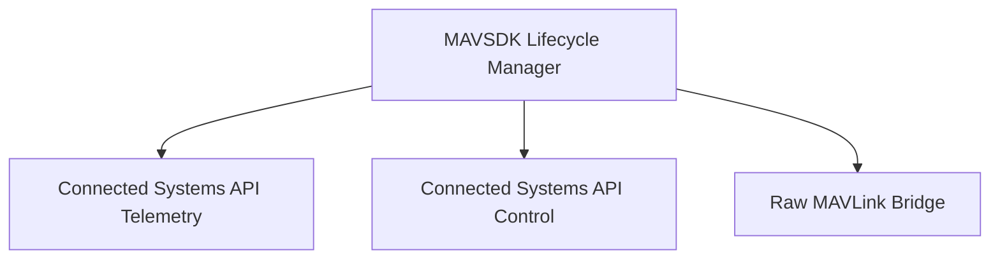

# Requirements: dd236a6cb88b

*Generated from the requirement-generator role's output. **4 requirements** partition the implementation work.*

## Dependency graph

## MAVSDK Lifecycle Manager

**ID:** `requirement.dd236a6cb88b.1` | **Status:** `active`

The system MUST manage the startup, connection, and teardown of the mavsdk_server process alongside the OpenSensorHub module lifecycle, and connect to a real or simulated MAVLink system.

**Verified by 4 scenario(s)** — see `scenarios.md`.

## Connected Systems API Telemetry

**ID:** `requirement.dd236a6cb88b.2` | **Status:** `active`

The system MUST expose typed MAVSDK telemetry, status, and event plugins as OGC Connected Systems API DataStreams and Observations. A coverage matrix mapping the MAVSDK plugin endpoints to CS API constructs SHALL be documented in the README.

**Depends on:** requirement.dd236a6cb88b.1

**Verified by 4 scenario(s)** — see `scenarios.md`.

## Connected Systems API Control

**ID:** `requirement.dd236a6cb88b.3` | **Status:** `active`

The system MUST expose MAVSDK control plugins as CS API ControlStreams. It SHALL expose status and result resources to track long-running commands.

**Depends on:** requirement.dd236a6cb88b.1

**Verified by 4 scenario(s)** — see `scenarios.md`.

## Raw MAVLink Bridge

**ID:** `requirement.dd236a6cb88b.4` | **Status:** `active`

The system MUST provide a generic MAVLink fallback exposing raw messages via DataStream and ControlStream. It SHALL support subscription, transmission, and custom XML dialects, and document MAVSDK vs native-MAVLink tradeoffs in the README.

**Depends on:** requirement.dd236a6cb88b.1

**Verified by 3 scenario(s)** — see `scenarios.md`.

