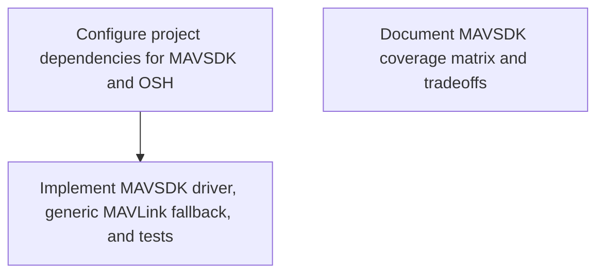

# Requirements: Starting from the existing OpenSensorHub MAVSDK addon at https://github.com/opensensorhub/osh-addons/tree/master/sensors/robotics/sensorhub-driver-mavsdk, design and implement MAVLink/MAVSDK support for OpenSensorHub through the OGC Connected Systems API.

Treat the upstream addon as the baseline, not a clean-room rewrite. Preserve its OSH sensor module patterns, MAVSDK Java integration, mavsdk_server lifecycle, existing telemetry outputs, and existing control inputs unless the architecture explicitly replaces them.

The implementation must provide full Connected Systems API coverage for MAVSDK plugins. For every plugin exposed by the pinned MAVSDK Java/proto version, produce a coverage matrix mapping the plugin's methods and streams to one of:
- CS API DataStream + Observation
- CS API ControlStream + Command + CommandStatus/CommandResult
- SystemEvent
- explicit unsupported/deferred entry with rationale

Prefer typed MAVSDK plugin integrations for semantic APIs. Also evaluate MAVLink-native access and implement a generic MAVLink fallback using MavlinkDirect or a native MAVLink library where needed for raw messages, custom dialects, or plugin gaps. Do not hand-roll MAVLink framing, do not stub MAVSDK/OSH classes, and do not claim full coverage without a machine-checkable coverage inventory.

Acceptance:
1. The driver starts a real mavsdk_server and connects to a real or simulated MAVLink system.
2. CS API exposes typed datastreams for telemetry/status/info/events and typed controlstreams for actions, missions, offboard/manual control, params, camera/gimbal, geofence, FTP/logs, calibration, RTK, shell/tune, transponder/winch/gripper, server-side plugins where applicable.
3. A generic raw MAVLink datastream/controlstream supports subscribe-all, subscribe-by-message-name, send-message, and load-custom-XML dialect.
4. Long-running commands expose status/result resources, not just fire-and-forget acknowledgements.
5. Tests include schema/coverage tests plus at least one live MAVSDK/SITL smoke test.
6. README documents MAVSDK vs native-MAVLink tradeoffs and the coverage matrix.

Test run: 1780110015106

*Generated from the requirement-generator role's output. **3 requirements** partition the implementation work.*

## Dependency graph

## Configure project dependencies for MAVSDK and OSH

**ID:** `requirement.182fec27c834.1` | **Status:** `active`

The build system must be configured with the OSH and MAVSDK Java dependencies required to bridge the MAVLink/MAVSDK stack into OpenSensorHub. It must specify the correct artifact repositories and dependency versions.

**Files owned:**

- `build.gradle`

**Verified by 3 scenario(s)** — see `scenarios.md`.

## Document MAVSDK coverage matrix and tradeoffs

**ID:** `requirement.182fec27c834.2` | **Status:** `active`

The project documentation must include a coverage matrix mapping MAVSDK plugins to CS API DataStream, ControlStream, SystemEvent, or explicit deferred status. It must also document the tradeoffs between MAVSDK and native-MAVLink fallbacks.

**Files owned:**

- `README.md`

**Verified by 2 scenario(s)** — see `scenarios.md`.

## Implement MAVSDK driver, generic MAVLink fallback, and tests

**ID:** `requirement.182fec27c834.3` | **Status:** `active`

The system must expose typed MAVSDK datastreams and controlstreams via the OGC Connected Systems API, support a generic MAVLink fallback for raw messages, and provide a test suite with coverage matrix and SITL smoke tests.

**Files owned:**

- `src/main/java/org/sensorhub/impl/sensor/mavsdk/UnmannedActivator.java`
- `src/main/java/org/sensorhub/impl/sensor/mavsdk/UnmannedSystem.java`
- `src/main/java/org/sensorhub/impl/sensor/mavsdk/UnmannedConfig.java`
- `src/main/java/org/sensorhub/impl/sensor/mavsdk/UnmannedDescriptor.java`
- `src/main/java/org/sensorhub/impl/sensor/mavsdk/util/MavSdkServerHandler.java`
- `src/main/java/org/sensorhub/impl/sensor/mavsdk/MavLinkCommNetwork.java`
- `src/main/java/org/sensorhub/impl/sensor/mavsdk/MavLinkNetworkProvider.java`
- `src/test/java/org/sensorhub/impl/sensor/mavsdk/MavsdkCoverageTest.java`
- `src/test/java/org/sensorhub/impl/sensor/mavsdk/MavsdkSmokeTest.java`

**Depends on:** requirement.182fec27c834.1

**Verified by 4 scenario(s)** — see `scenarios.md`.

