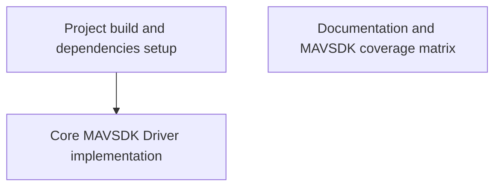

# Requirements: Starting from the existing OpenSensorHub MAVSDK addon at https://github.com/opensensorhub/osh-addons/tree/master/sensors/robotics/sensorhub-driver-mavsdk, design and implement MAVLink/MAVSDK support for OpenSensorHub through the OGC Connected Systems API.

Treat the upstream addon as the baseline, not a clean-room rewrite. Preserve its OSH sensor module patterns, MAVSDK Java integration, mavsdk_server lifecycle, existing telemetry outputs, and existing control inputs unless the architecture explicitly replaces them.

The implementation must provide full Connected Systems API coverage for MAVSDK plugins. For every plugin exposed by the pinned MAVSDK Java/proto version, produce a coverage matrix mapping the plugin's methods and streams to one of:
- CS API DataStream + Observation
- CS API ControlStream + Command + CommandStatus/CommandResult
- SystemEvent
- explicit unsupported/deferred entry with rationale

Prefer typed MAVSDK plugin integrations for semantic APIs. Also evaluate MAVLink-native access and implement a generic MAVLink fallback using MavlinkDirect or a native MAVLink library where needed for raw messages, custom dialects, or plugin gaps. Do not hand-roll MAVLink framing, do not stub MAVSDK/OSH classes, and do not claim full coverage without a machine-checkable coverage inventory.

Acceptance:
1. The driver starts a real mavsdk_server and connects to a real or simulated MAVLink system.
2. CS API exposes typed datastreams for telemetry/status/info/events and typed controlstreams for actions, missions, offboard/manual control, params, camera/gimbal, geofence, FTP/logs, calibration, RTK, shell/tune, transponder/winch/gripper, server-side plugins where applicable.
3. A generic raw MAVLink datastream/controlstream supports subscribe-all, subscribe-by-message-name, send-message, and load-custom-XML dialect.
4. Long-running commands expose status/result resources, not just fire-and-forget acknowledgements.
5. Tests include schema/coverage tests plus at least one live MAVSDK/SITL smoke test.
6. README documents MAVSDK vs native-MAVLink tradeoffs and the coverage matrix.

Test run: 1780102103316

*Generated from the requirement-generator role's output. **3 requirements** partition the implementation work.*

## Dependency graph

## Project build and dependencies setup

**ID:** `requirement.7cb2e6e5ae4b.1` | **Status:** `active`

The build system must configure Gradle settings and dependencies to include MAVSDK Java, MAVLink raw message libraries, and the OpenSensorHub OGC Connected Systems API, establishing the foundational project structure.

**Files owned:**

- `build.gradle`
- `settings.gradle`

**Verified by 3 scenario(s)** — see `scenarios.md`.

## Documentation and MAVSDK coverage matrix

**ID:** `requirement.7cb2e6e5ae4b.2` | **Status:** `active`

The README must document the tradeoffs between using typed MAVSDK plugins and native MAVLink. It must also contain a machine-checkable coverage matrix mapping all MAVSDK plugins to CS API Observation/DataStreams, Command/ControlStreams, SystemEvents, or explicitly deferred entries with rationale.

**Files owned:**

- `README.md`

**Verified by 3 scenario(s)** — see `scenarios.md`.

## Core MAVSDK Driver implementation

**ID:** `requirement.7cb2e6e5ae4b.3` | **Status:** `active`

The system must implement the core driver logic to start a mavsdk_server, connect to a 'MAVLink Vehicle', and map MAVSDK telemetry and commands to the OGC Connected Systems API. An 'Operator' must be able to use these mapped interfaces for telemetry and control. It must also provide a generic raw MAVLink fallback stream and include integration tests verifying these interactions.

**Files owned:**

- `src/main/java/org/sensorhub/impl/sensor/mavsdk/UnmannedSystem.java`
- `src/main/java/org/sensorhub/impl/sensor/mavsdk/UnmannedConfig.java`
- `src/main/java/org/sensorhub/impl/sensor/mavsdk/UnmannedProvider.java`
- `src/main/java/org/sensorhub/impl/sensor/mavsdk/telemetry/TelemetryStream.java`
- `src/main/java/org/sensorhub/impl/sensor/mavsdk/control/ControlStream.java`
- `src/main/java/org/sensorhub/impl/sensor/mavsdk/raw/RawMavlinkStream.java`
- `src/main/java/org/sensorhub/impl/sensor/mavsdk/util/MavSdkServerHandler.java`
- `src/main/resources/META-INF/services/org.sensorhub.api.module.IModuleProvider`
- `src/test/java/org/sensorhub/impl/sensor/mavsdk/MavsdkSmokeTest.java`
- `src/test/java/org/sensorhub/impl/sensor/mavsdk/CoverageMatrixTest.java`

**Depends on:** requirement.7cb2e6e5ae4b.1

**Verified by 4 scenario(s)** — see `scenarios.md`.

